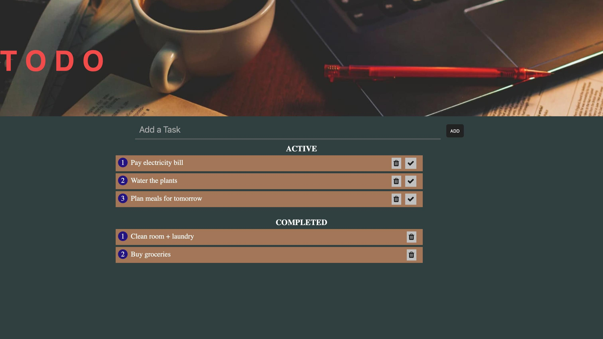

# To-Do List (HTML, CSS, JavaScript)

A simple to-do list app built with **vanilla JavaScript**.
It allows users to add tasks, mark them as completed, and delete them.

## Features
- Add tasks (button or Enter key)
- Active and Completed task sections
- Delete tasks

## Tech Used
HTML • CSS • JavaScript (Vanilla JS)

## How to Run
Open `index.html` in your browser. No setup required.

## What I Learned
- DOM manipulation
- Event handling in JavaScript
- Basic UI interactions
